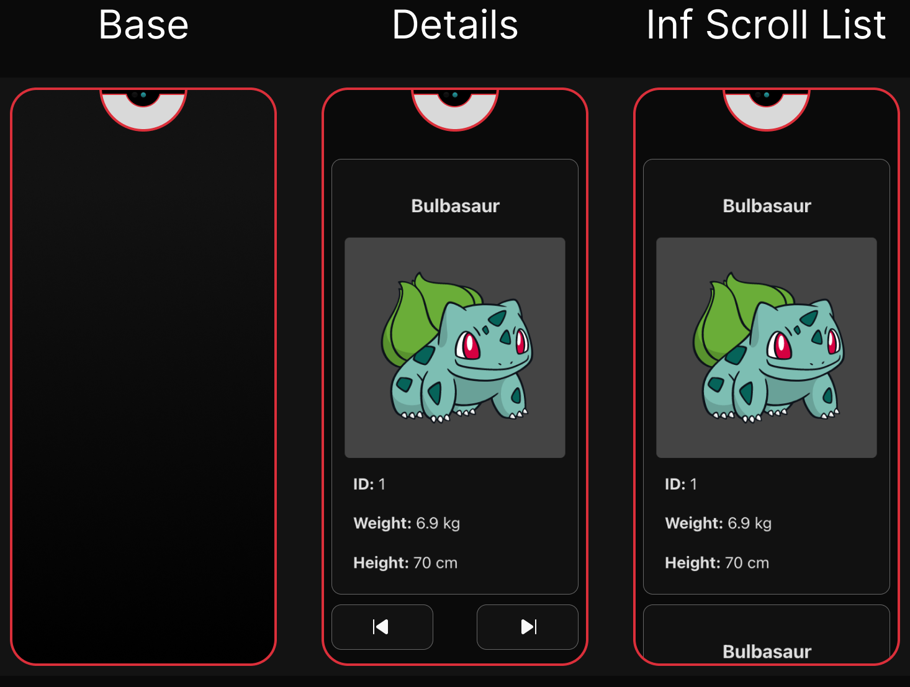

# Pokedex

Fun little project to test out some ideas using the [PokeAPI GraphQL API](https://github.com/PokeAPI/pokeapi?tab=readme-ov-file).

<p align="center" style="padding:16px;">
  
</p>
<blockquote align="center">Designs</blockquote>

## Contents

- [Prerequisites](#prerequisites)
- [Quick Start](#quick-start)
- [GrapQL Console](#grapql-console)
- [Server](#server)
  - [Codegen GQL TS types from Schema](#codegen-gql-ts-types-from-schema)
- [Client](#client)
  - [FE Codegen GQL TS types from schema](#fe-codegen-gql-ts-types-from-schema)
- [React + TypeScript + Vite](#react-+-typescript-+-vite)

## Prerequisites

- Follow the docker compose steps for: [PokeAPI](https://github.com/PokeAPI/pokeapi?tab=readme-ov-file)
- Place the PokeAPI project one directory out at: `../pokeapi`
- Finally, ensure the docker engine is running on your machine

> See the `npm run docker:start` script for more info

## Quick Start

1. `npm i`
2. `npm start`

## GrapQL Console

1. ensure docker is running
2. `npm run server`
3. `npm run server:console` - opens the apollo-server GQL console

## Server

### Codegen GQL TS types from Schema

Followed this: [Generating types from a GraphQL schema](https://www.apollographql.com/docs/apollo-server/workflow/generate-types/)
and this [Codegen Resolvers](https://the-guild.dev/graphql/codegen/plugins/typescript/typescript-resolvers)

Uses `schema.grapqhl` to generate server types. In order to add more resolvers etc modify schema.graqphl

```sh
"codegen:server": "graphql-codegen --config ./server/codegen.ts",
```

> Note: Extra types are included incase I want to extend the functionality later.

## Client

### FE Codegen GQL TS types from schema

> Note: using a custom apollo-server config now so this will get changed.

Uses: [GraphQL-Codegen](https://the-guild.dev/graphql/codegen/docs/config-reference)

```sh
  "codegen:client": "graphql-codegen -w",
```

Instead of `import { gql } from apollo` you import the generated version from `"./src/__generated__/gql.ts"`.

- To make this easier I have aliased it as `"gql": ["./src/__generated__/gql.ts"]` in `tsconfig.json`.
  This also requires the `vite-tsconfig-paths` plugin to work.

## React + TypeScript + Vite

This template provides a minimal setup to get React working in Vite with HMR and some ESLint rules.

Currently, two official plugins are available:

- [@vitejs/plugin-react](https://github.com/vitejs/vite-plugin-react/blob/main/packages/plugin-react/README.md) uses [Babel](https://babeljs.io/) for Fast Refresh
- [@vitejs/plugin-react-swc](https://github.com/vitejs/vite-plugin-react-swc) uses [SWC](https://swc.rs/) for Fast Refresh

## Todo

- [x] basic designs
- [ ] pagination
  - [x] server
  - [ ] client
- [ ] search?
- [ ] 3d pokemon viewer
