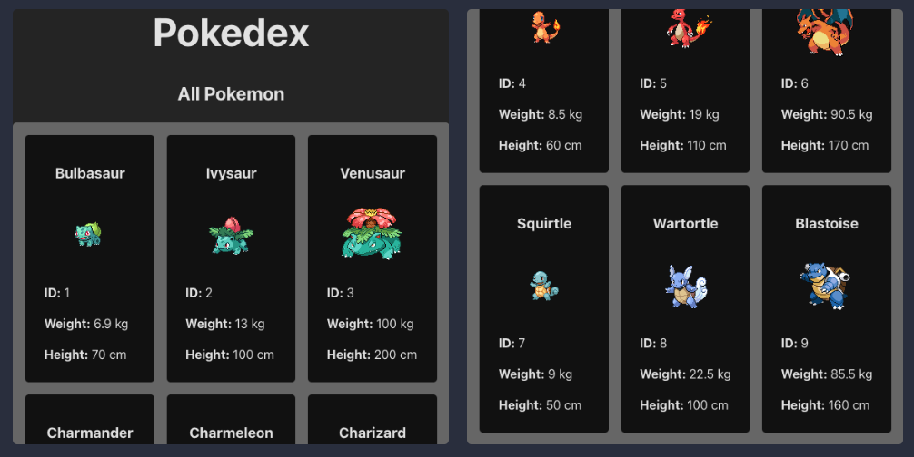

# Pokedex

Fun little project to test out some ideas using the [PokeAPI GraphQL API](https://github.com/PokeAPI/pokeapi?tab=readme-ov-file).

<p align="center" style="padding:16px;">
  
</p>

## Contents

- [Prerequisites](#prerequisites)
- [GrapQL Console](#grapql-console)
- [Automatic GQL typing based on queries used + Schema](#automatic-gql-typing-based-on-queries-used-+-schema)
- [React + TypeScript + Vite](#react-+-typescript-+-vite)

## Prerequisites

- Follow the docker compose steps for: [PokeAPI](https://github.com/PokeAPI/pokeapi?tab=readme-ov-file)
- I have the folder one directory out: `../pokeapi`

## GrapQL Console

1. ensure docker is running
2. `npm run server:start`
3. `http:localhost:8080` - console endpoint
4. password: `pokemon`

- `http://localhost:8080/v1/graphql`: gql endpoint

## Automatic GQL typing based on queries used + Schema

Uses: [GraphQL-Codegen](https://the-guild.dev/graphql/codegen/docs/config-reference)

```sh
  "codegen:compile": "graphql-codegen",
  "codegen:watch": "graphql-codegen -w"
```

Instead of `import { gql } from apollo` you import the generated version from `"./src/__generated__/gql.ts"`.

- To make this easier I have aliased it as `"gql": ["./src/__generated__/gql.ts"]` in `tsconfig.json`.
  This also requires the `vite-tsconfig-paths` plugin to work.

## React + TypeScript + Vite

This template provides a minimal setup to get React working in Vite with HMR and some ESLint rules.

Currently, two official plugins are available:

- [@vitejs/plugin-react](https://github.com/vitejs/vite-plugin-react/blob/main/packages/plugin-react/README.md) uses [Babel](https://babeljs.io/) for Fast Refresh
- [@vitejs/plugin-react-swc](https://github.com/vitejs/vite-plugin-react-swc) uses [SWC](https://swc.rs/) for Fast Refresh

## Todo

- [ ] pagination
  - May need to write custom server logic to compose grapqh data together.
- [ ] search?
- [ ] 3d pokemon viewer
